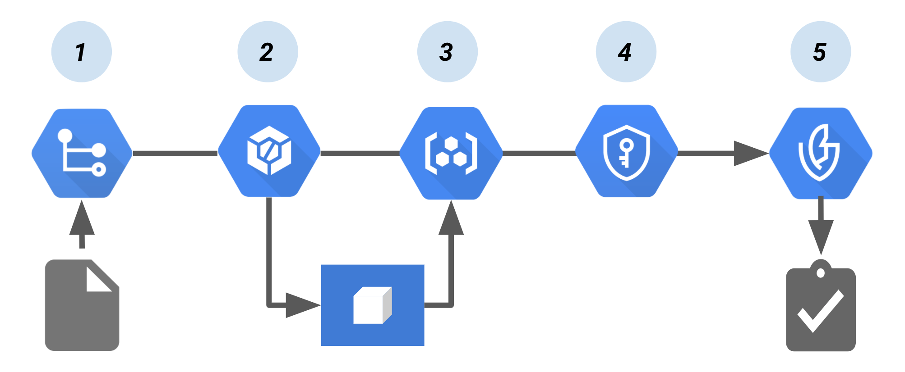

# ☁️ Gating Deployments with Binary Authorization

Hey there! 👋  
This page documents my hands-on experience with how to create an Attestor to sign images to validate rules before a container image is allowed to run. You learned how to write a policy to inform Cloud Build to allow or deny access to the GKE cluster, and you have used Binary Authorization with Google Cloud KMS to validate image signatures, and prevent unsigned images access to the Kubernetes cluster. Everything here is based on the actual labs I’ve completed and tested — feel free to refer to the scripts and notes if you're doing something similar.

---

## Overview
Binary Authorization is a deploy-time security control that ensures only trusted container images are deployed on Google Kubernetes Engine (GKE) or Cloud Run. With Binary Authorization, you can require images to be signed by trusted authorities during the development process and then enforce signature validation when deploying. By enforcing validation, you can gain tighter control over your container environment by ensuring only verified images are integrated into the build-and-release process.

The following diagram shows the components in a Binary Authorization/Cloud Build setup:

Cloud Build pipeline that creates a Binary Authorization attestation.

# 🛠️ Container Image CI/CD Pipeline with Binary Authorization

This pipeline outlines a secure and automated approach for building, signing, and deploying container images using Google Cloud services.

---

## 🔁 Pipeline Steps

1. **Source Code Push**
   - Code to build the container image is pushed to a source repository, such as **Cloud Source Repositories**.

2. **Continuous Integration (CI)**
   - A CI tool like **Cloud Build** builds and tests the container image automatically.

3. **Image Registry**
   - The built container image is pushed to **Container Registry** or another image registry.

4. **Image Signing**
   - **Cloud Key Management Service (KMS)** manages the cryptographic key pair.
   - The container image is signed using this key pair.
   - The generated signature is stored as an **attestation**.

5. **Deployment & Policy Enforcement**
   - At deployment, an **attestor** verifies the attestation using the public key from the KMS key pair.
   - **Binary Authorization** enforces deployment policies by requiring valid, signed attestations.

---
## 🎓 What I Learned

- **Image Signing** – Learn how to cryptographically sign container images for verification.
- **Admission Control Policies** – Understand how policies control what gets deployed.
- **Signing Scanned Images** – Ensure only scanned and verified images are signed.
- **Authorizing Signed Images** – Use attestations to authorize image deployments.
- **Blocking Unsigned Images** – Prevent deployment of unverified or unsigned images.

---
## 🙏 Credits & Acknowledgments

I deeply appreciate the work and content provided by the Google Cloud team. If you spot something that belongs to you and would like credit or removal, just shoot me a message!

> All original content belongs to **Google Cloud**, accessible via the [Google Cloud Skills Boost](https://www.cloudskillsboost.google/) platform.  
> This is just my personal take to document, reinforce, and share what I’ve learned.

---